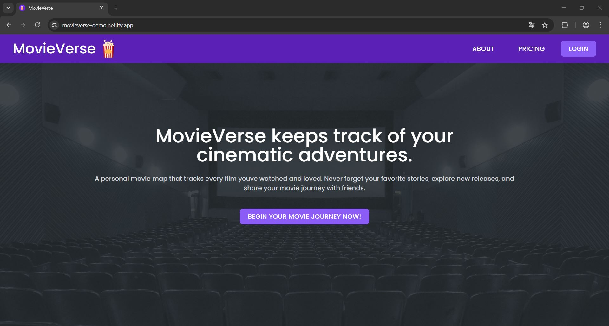
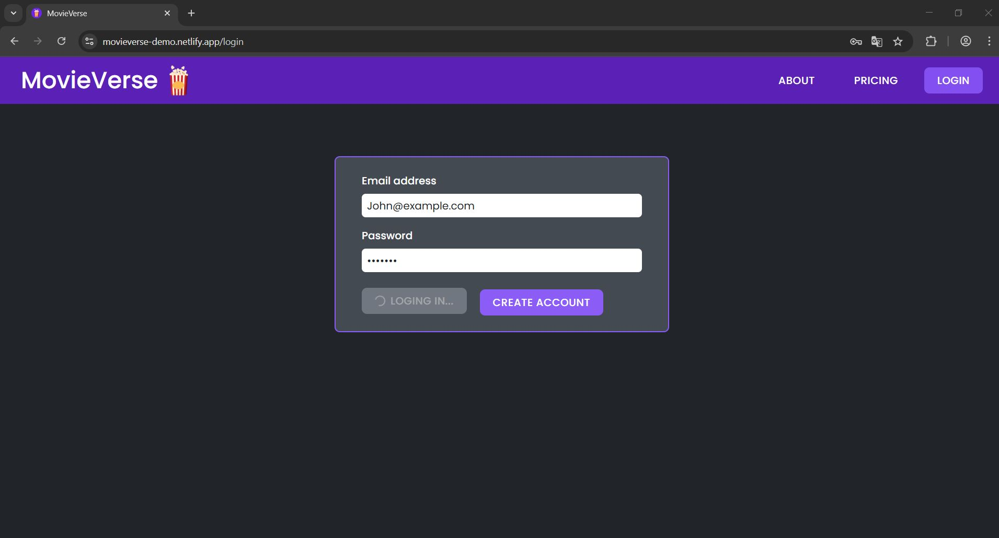
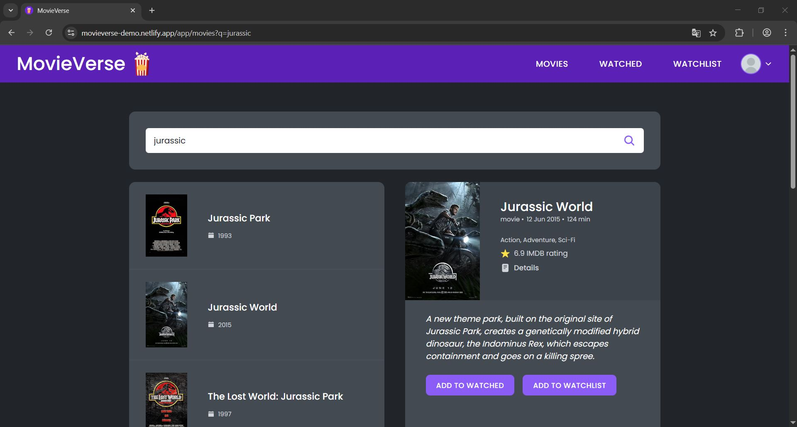
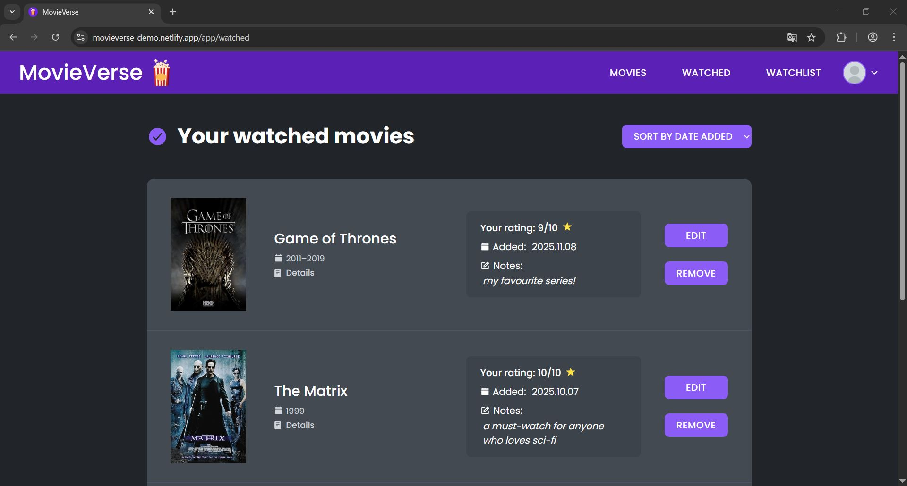
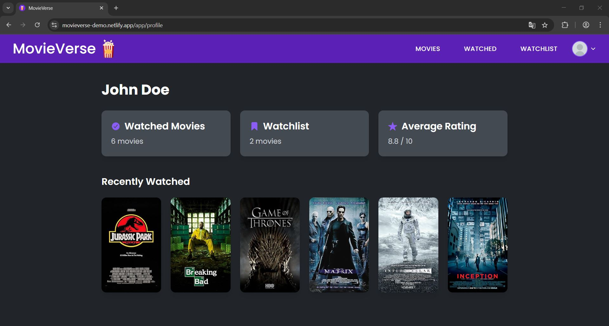

# 🎬 MovieVerse

MovieVerse is a modern single page web application that helps you keep track of the movies you watch, plan to watch, and rate. Built with **React, Redux Toolkit, React Router v7, and Tailwind CSS**, it delivers a fast, clean, and intuitive experience for movie lovers.

---

## 🚀 Demo

🔗 Live preview: https://movieverse-demo.netlify.app/

---

## 📌 Features

### 🎥 Movie Search

- Search for movies using the OMDb API
- View detailed information about each movie

### ⭐ Ratings & Opinions

- Rate movies 1–10
- Add a short personal opinion
- Data saved via LocalStorage + Redux Toolkit

### 📚 Watchlist & Watched Lists

- Add movies to Watchlist
- Mark movies as Watched
- Remove or update entries

### 👤 User Profile

- See your average movie rating
- Total watched movies
- Clean, simple dashboard

### ⚙️ Settings

- Toggle application preferences

### 🔐 Auth Simulation

- Demo login flow
- Protected routes using React Router v7
- Redirects for unauthorized users

---

## 🛠 Tech Stack

**Frontend**

- React 19
- React Router DOM v7
- Redux Toolkit
- Tailwind CSS
- React Icons

**Tooling**

- Vite
- ESLint + Prettier
- Netlify deployment

---

## 📁 Project Structure

```
src/
├─ app/
│ ├─ App.jsx
│ ├─ AppLayout.js
│ ├─ main.js
│ ├─ store.js
│ └─ initialState.js
├─ features/
│ ├─ auth/ # Redux slice for authentication state
│ ├─ movies/ # Redux slice for movie search, ratings, lists
├─ pages/
│ ├─ Home.jsx
│ ├─ NotFound.jsx
│ ├─ Dashboard.jsx
│ ├─ Login.jsx
│ ├─ About.jsx
│ ├─ Pricing.jsx
│ ├─ Movies.jsx
│ ├─ MoviePage.jsx
│ ├─ Watched.jsx
│ ├─ Watchlist.jsx
│ ├─ Profile.jsx
│ └─ Settings.jsx
├─ routes/
│ ├─ routes.jsx
│ ├─ ProtectedRoute.jsx
│ └─ PublicRoute.jsx
├─ shared/
│ ├─ ui/
│ ├─ assets/
│ └─ styles/
│ └─ utils/
```

---

## 🧪 Installing & Running Locally

1. Clone the repo:
   git clone https://github.com/maciej-galuszka/movieverse.git
   cd movieverse

2. Install dependencies:
   npm install

3. Start dev server:
   npm run dev

4. Build for production:
   npm run build

---

## 🌐 Deployment (Netlify)

Add a \`\_redirects\` file in \`/public\`:

/\* /index.html 200

Vite config:
export default {
plugins: [react()],
resolve: { alias: { "@": path.resolve(\_\_dirname, "./src") } }
}

---

## 🎯 Why I Built This Project

MovieVerse was created to practice:

- Global state management with Redux Toolkit
- Navigation with React Router v7
- Tailwind CSS styling
- Realistic SPA architecture
- Deployment on Netlify

---

## 📸 Screenshots

### 🏠 Home Page

Clean and welcoming landing screen of the SPA



---

### 🔐 Login Page

Authentication screen with form validation, error handling, and Redux-based mock login. Successful login redirects the user to the main application dashboard.



---

### 🔎 Movie Search

Advanced movie search powered by the OMDb API. Includes poster validation, duplicate filtering, loading states, and an adaptive results list that updates in real time.



---

### ⭐ Watched Movies

A dedicated section for all watched titles. Users can add ratings, write personal notes, sort movies by multiple criteria, and keep a persistent history stored in localStorage.



---

### 👤 Profile Page

User profile with an overview of activity: total watched movies, watchlist count, average personal rating, and a gallery of recently watched films.



---

---

## 📬 Contact

**Maciej Gałuszka**  
Email: maciej.galuszka@outlook.com
LinkedIn: https://www.linkedin.com/in/maciej-gałuszka-259672363

---

## ⭐ Support

If you like this project, consider giving it a star ⭐ on GitHub!
